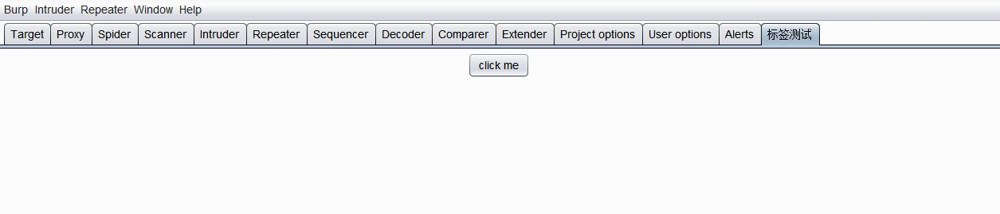
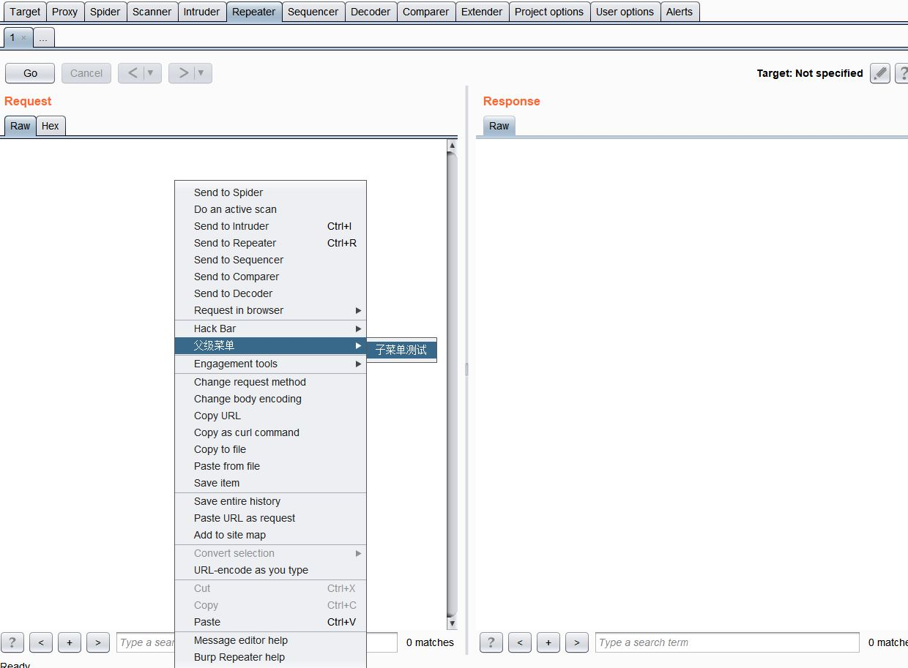
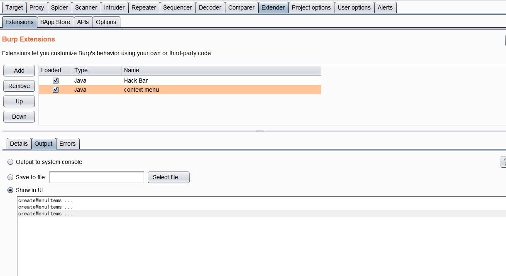
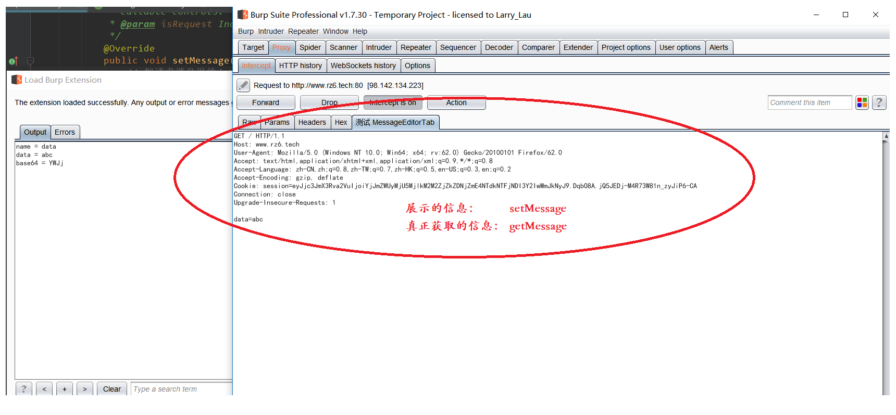
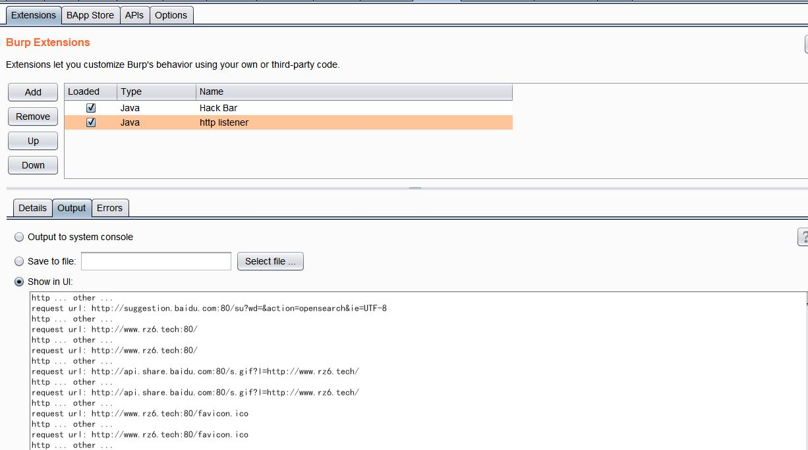
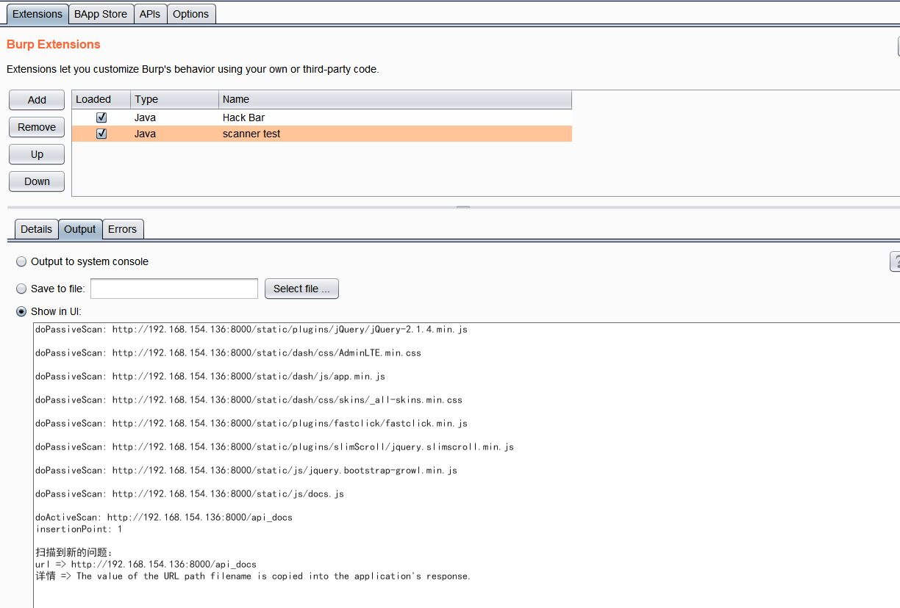
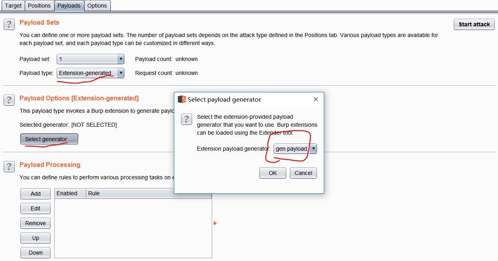
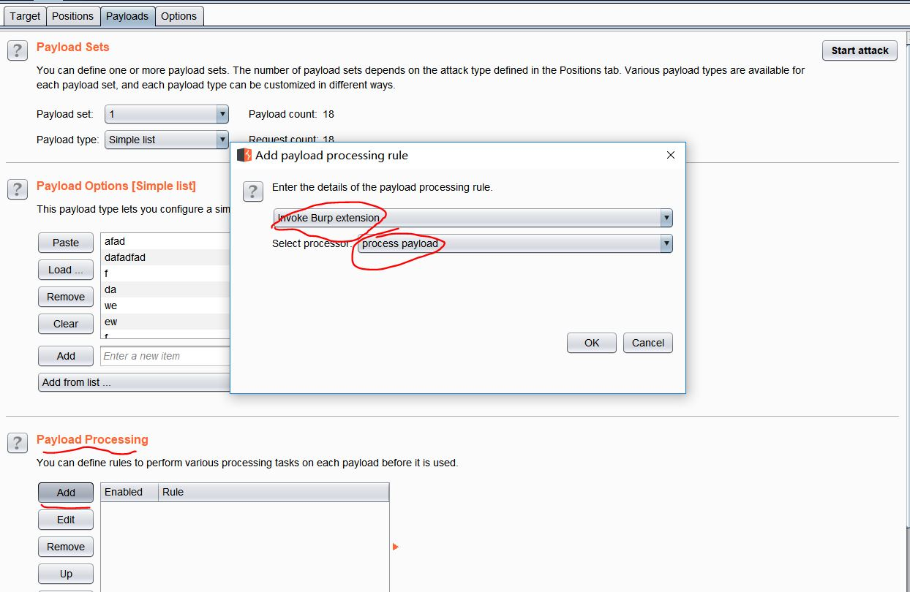
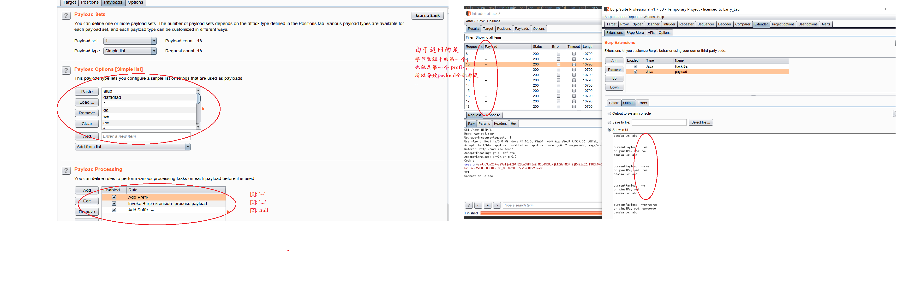

# burp插件demo

### tabtest

- `ITab` 页面上的标签

### contextmenu

- `IContextMenuFactory` 右键时的菜单
   

### statelistener

- `IExtensionStateListener` 监听插件的状态（目前好像只有卸载状态）

### messageeditortab

- `IMessageEditorTabFactory` 扩展插件可以在Burp的Http编辑器中渲染或编辑http信息

  

### httplistener

- `IHttpListener` Burp里任何一个工具发http请求或收到http响应时都会通知此监听器

- `IProxyListener` 代理监听

  

### scanner

- `IScannerCheck`  注册一个自定义的Scanner工具的检查器，Burp会告知检查器执行“主动扫描”或“被动扫描”，并在确认扫描问题时提供报告

- `IScannerListener`  Scanner监听器，当Scanner工具扫描到新的问题时，会通知这个监听器。可以对扫描的问题进行自定义的分析记录

  

### payload

- `IIntruderPayloadGeneratorFactory`： Intruder中的payload生成器

- `IIntruderPayloadProcessor`： Intruder中的payload处理器

    

### scope session

- `IScopeChangeListener` 当 Burp 的 Target 工具下的 scope 发生变化时，将会通知此接口

- `ISessionHandlingAction` 每一个已注册的会话操作动作在会话操作规则的UI中都是可用的，并且用户可以选择其中一个作为会话操作行为的规则。用户可以选择直接调用操作，也可以按照宏定义调用操作

### 参考

>  [BurpSuite插件开发指南之 API 上篇 – Her0in](http://drops.wooyun.org/tools/14040)
>
>  [BurpSuite插件开发指南之 API 下篇 – Her0in](http://drops.wooyun.org/tools/14685)
>
>  [Package Burp](https://portswigger.net/burp/extender/api/burp/package-summary.html)